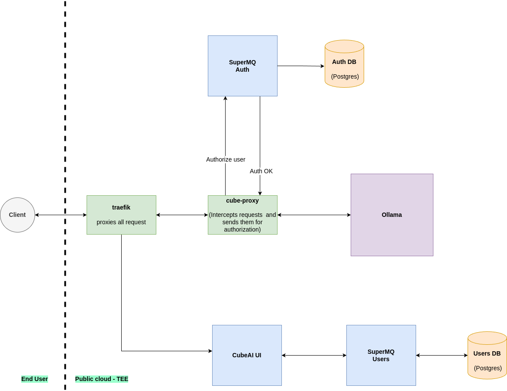

# Architecture

Cube AI is built on top of Magistrala, Ollama and a custom proxy server. All these host the Cube AI API that hosts the AI models and protects prompts and user data securely.

## Magistrala

Cube AI uses Magistrala Users and Auth Service to manage users and authentication. Magistrala is an IoT platform that provides a secure and scalable way to manage IoT devices. Since Magistrala is based on micro-service architecture, auth and users are separated from the core application. This allows for better scalability and security. Magistrala is responsible for users authentication, authorization and user management. It also provides a secure way to store user data.

## Ollama

Ollama is a framework that provides a unified interface for interacting with different LLMs. Ollama is responsible for managing LLMs and their configurations. It provides a unified interface for interacting with different LLMs, allowing developers to easily switch between different LLMs without having to change their code. Ollama also provides a way to manage LLMs, including configuring LLMs, managing prompts, and managing models.

## Proxy Server

The proxy server is responsible for handling requests to ollama. Once a user is registered on Magistrala and issued with an access token, the user can interact with Cube AI using the issued token. The proxy server will verify the token and ensure that the user has the necessary permissions to access the Cube AI API by checking it with the Magistrala Auth Service. Once the request is verified, the proxy server will forward the request to the appropriate Ollama instance. The proxy server also handles authentication and authorization for the user. It ensures that only authorized users can access the Cube AI API.
